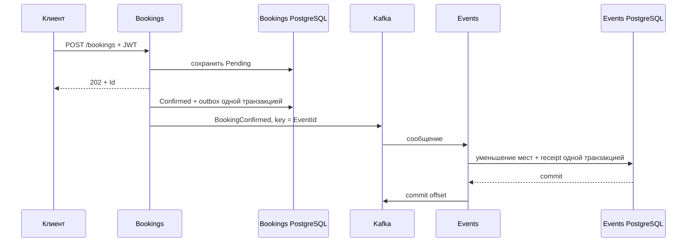

# Event Manager API

REST API для управления мероприятиями, реализованный на ASP.NET Core Web API. В спринте 9 монолит разделён на три независимых сервиса: Users/Auth, Events и Bookings. Каждый имеет свою PostgreSQL; взаимодействие между сервисами выполняется асинхронно через Apache Kafka. В спринте 10 в Events добавлен Redis: кеширование мероприятия по ID и публичного рейтинга топ-10.

## Требования

- .NET 10 SDK — для сборки и запуска тестов на хосте.
- Docker Desktop с Linux containers или Docker Engine с Compose v2 — для запуска системы.
- Git — для работы с репозиторием.

## Архитектура проекта (Clean Architecture)

Приложение разделено на три самостоятельных сервиса. Каждый сервис сохраняет четыре слоя чистой архитектуры, знакомые по предыдущим спринтам.

| Сервис | Где находится код | Ответственность | HTTP / Swagger | Своя PostgreSQL |
|---|---|---|---|---|
| Users/Auth | [src/Services/Users](src/Services/Users) | Регистрация, хеширование пароля, вход и выдача JWT | [localhost:5001/swagger](http://localhost:5001/swagger) | `users`, порт хоста 5433 |
| Events | [src/Services/Events](src/Services/Events) | CRUD мероприятий, учёт мест, Kafka, кеш Redis и топ-10 | [localhost:5002/swagger](http://localhost:5002/swagger) | `events`, порт хоста 5434 |
| Bookings | [src/Services/Bookings](src/Services/Bookings) | Создание, подтверждение и отмена броней, отправка сообщений Kafka | [localhost:5003/swagger](http://localhost:5003/swagger) | `bookings`, порт хоста 5435 |

**Users/Auth — один сервис.** Users — название сервиса и папки; Auth — его контроллер и маршруты `/auth/register`, `/auth/login`.

1. **Domain** (`AspNetProject.<Сервис>.Domain`) — доменные сущности, бизнес-правила и исключения. Не имеет внешних зависимостей.
2. **Application** (`AspNetProject.<Сервис>.Application`) — прикладные сервисы, интерфейсы репозиториев и DTO. Зависит от своего Domain; Events и Bookings также используют Contracts. Не зависит от Infrastructure.
3. **Infrastructure** (`AspNetProject.<Сервис>.Infrastructure`) — реализация репозиториев, собственный DbContext, миграции и внешние взаимодействия. Здесь находятся Kafka producer/consumer и фоновые обработчики.
4. **Presentation** — в новых сервисах называется **Api** (`AspNetProject.<Сервис>.Api`). Содержит контроллеры, `Program.cs`, конфигурацию, Swagger и Dockerfile. Именно Api является запускаемым проектом.

Пример структуры одного сервиса:

```text
src/Services/Events/
  AspNetProject.Events.Domain/
  AspNetProject.Events.Application/
  AspNetProject.Events.Infrastructure/
  AspNetProject.Events.Api/
    Controllers/EventsController.cs
    Program.cs
    appsettings.json
    Dockerfile
```

Структура репозитория:

```text
AspNetProject.sln
src/
  Services/
    Users/        # Domain, Application, Infrastructure, Api
    Events/       # Domain, Application, Infrastructure, Api
    Bookings/     # Domain, Application, Infrastructure, Api
  Shared/
    AspNetProject.Contracts/
tests/
  AspNetProject.Sprint9.Tests/
  AspNetProject.Sprint10.Tests/
docker-compose.yml
README.md
```

Решение включает 15 проектов: 12 слоёв сервисов, общую библиотеку контрактов и два проекта тестов. Миграции находятся в Infrastructure каждого сервиса.

## Установка и запуск

```bash
# 1. Клонируйте репозиторий
git clone https://github.com/ddamage2389/AspNetProject
cd AspNetProject
git switch sprint-10

# 2. При установленном .NET SDK можно проверить сборку
dotnet build

# 3. Соберите и запустите всю систему
docker compose up -d --build

# 4. Проверьте контейнеры
docker compose ps
```

Команда Compose запускает девять компонентов: Users, Events, Bookings, три PostgreSQL, Kafka, Zookeeper и Redis. Каждый API применяет свои миграции при запуске. Events создаёт Kafka-топики автоматически.

Swagger доступен на портах 5001, 5002 и 5003 из таблицы выше. В Docker все API слушают порт 8080, но каждый контейнер имеет свой порт на хосте.

Управление окружением:

```bash
docker compose logs -f users events bookings
docker compose down
```
### Запуск API из IDE или через dotnet run

Сначала запустите только инфраструктуру:

```bash
docker compose up -d users-db events-db bookings-db zookeeper kafka redis
```

Затем в отдельных терминалах:

```bash
dotnet run --project src/Services/Users/AspNetProject.Users.Api
dotnet run --project src/Services/Events/AspNetProject.Events.Api
dotnet run --project src/Services/Bookings/AspNetProject.Bookings.Api
```

Если API уже работают в Compose, освободите их порты командой `docker compose stop users events bookings`. В Visual Studio можно назначить три проекта с окончанием `.Api` запускаемыми проектами решения.

Локальные настройки используют PostgreSQL на 5433–5435, Kafka на `localhost:9092` и Redis на `localhost:6379`. Для создания администратора при локальном запуске Users задайте `SeedAdmin__Login` и `SeedAdmin__Password` в окружении процесса.

## Краткая документация API

Адрес запроса складывается из адреса нужного сервиса и его маршрута. Например, `http://localhost:5002/events` обращается к Events, а `http://localhost:5003/bookings` — к Bookings.

| Сервис | Метод | Эндпоинт | Описание | Основные статусы |
|---|---|---|---|---|
| Users | POST | `/auth/register` | Зарегистрировать пользователя | 204, 400, 409 |
| Users | POST | `/auth/login` | Получить JWT | 200, 400, 401 |
| Events | GET | `/events` | Получить события | 200 |
| Events | GET | `/events/top` | Топ-10 по доле проданных мест, без авторизации | 200 |
| Events | GET | `/events/{id}` | Получить событие по ID | 200, 404 |
| Events | POST | `/events` | Создать событие | 201, 400, 401, 403 |
| Events | PUT | `/events/{id}` | Изменить событие | 200, 400, 401, 403, 404, 409 |
| Events | DELETE | `/events/{id}` | Удалить событие | 204, 401, 403, 404, 409 |
| Bookings | POST | `/bookings` | Создать бронь со статусом Pending | 202, 400, 401, 409 |
| Bookings | GET | `/bookings/{id}` | Получить свою бронь; Admin — любую | 200, 401, 404 |
| Bookings | DELETE | `/bookings/{id}` | Отменить бронь | 204, 401, 403, 404, 409 |
| Каждый API | GET | `/health` | Проверить доступность своей БД | 200, 503 |

Эндпоинт `GET /events` поддерживает параметры запроса:

| Параметр | Тип | Описание |
|---|---|---|
| `title` | string | Поиск по названию: регистронезависимый, частичное совпадение |
| `from` | DateTime | События, начинающиеся не раньше указанной даты |
| `to` | DateTime | События, заканчивающиеся не позже указанной даты |
| `page` | int | Номер страницы, по умолчанию 1; минимум 1 |
| `pageSize` | int | Размер страницы, по умолчанию 10; от 1 до 100 |

Пример:

```http
GET http://localhost:5002/events?title=митап&from=2030-06-01T00:00:00Z&to=2030-06-30T23:59:59Z&page=1&pageSize=5
```

Результат содержит `items`, `totalCount`, `page` и `pageSize`. Перед пагинацией применяется сортировка по дате начала и ID.

## Правила валидации

- У мероприятия должен быть непустой `title` длиной до 200 символов; описание — до 2000 символов.
- `endAt` должен быть позже `startAt`; даты в примерах передаются в UTC с суффиксом `Z`.
- При создании мероприятия `totalSeats` должен быть больше нуля.
- При создании брони `eventId` должен быть непустым GUID, `seats` — положительным числом. Если `seats` не передан, используется 1.
- `UserId` берётся из JWT, а не из тела запроса.
- Логин при регистрации — от 3 до 50 символов, пароль — от 6 до 100. Логин уникален; пробелы по краям обрезаются.
- По умолчанию у пользователя может быть не более пяти активных броней (Pending + Confirmed).

## Обработка ошибок

В каждом API есть middleware для перехвата исключений. Обработанные им ошибки возвращаются в формате Problem Details. Валидация модели, стандартные ответы авторизации и отдельные ответы AuthController могут иметь другой формат или пустое тело.

Пример тела ошибки middleware:

```json
{
  "title": "Seats must be positive.",
  "status": 400
}
```

Основные коды статусов:

| Код | Описание |
|---|---|
| 400 Bad Request | Ошибка входных данных |
| 401 Unauthorized | Нет корректного токена или неверные данные входа |
| 403 Forbidden | Недостаточная роль или попытка отменить чужую бронь |
| 404 Not Found | Ресурс отсутствует; при чтении также скрывается чужая бронь |
| 409 Conflict | Лимит активных броней, конфликт конкурентного изменения или уникальности |
| 500 Internal Server Error | Непредвиденная ошибка сервера |

Нехватка мест в Events не возвращает 409 уже завершившемуся запросу создания брони: она обнаруживается позже, при асинхронной обработке сообщения.

## Модель Event

| Поле | Тип | Описание |
|---|---|---|
| `Id` | Guid | Идентификатор мероприятия |
| `Title` | string | Название |
| `Description` | string? | Описание |
| `StartAt / EndAt` | DateTime | Даты начала и окончания |
| `TotalSeats` | int | Вместимость, задаётся при создании |
| `AvailableSeats` | int | Текущий остаток мест |

При создании `AvailableSeats = TotalSeats`. `PUT /events/{id}` редактирует название, описание и даты; вместимость и остаток мест этим запросом не меняются.

В Domain сохранены методы `TryReserveSeats` и `ReleaseSeats` для изменения отдельного объекта. В обработчике Kafka используется условный SQL UPDATE через EF Core: проверка остатка и списание выполняются атомарно в БД. Это обеспечивает корректность между несколькими процессами сервиса, чего сам по себе метод объекта не гарантирует.

## Фоновая обработка бронирований

В Bookings работают два `BackgroundService`:

1. `BookingProcessingWorker` каждые 5 секунд выбирает до 50 броней Pending. Для каждой создаёт scope и вызывает `BookingService.ConfirmAsync`.
2. При подтверждении статус меняется на Confirmed, заполняется `ProcessedAt`; в той же транзакции сохраняется сообщение в таблицу `outbox`.
3. `OutboxWorker` читает сохранённые сообщения, отправляет их в Kafka и после успешной отправки записывает `PublishedAt`.
4. При ошибке отправки сообщение остаётся в outbox для повтора; между неудачными попытками предусмотрена задержка.

Клиент получает `202 Accepted` сразу после сохранения Pending и затем может читать статус по адресу из заголовка Location.

### Обмен сообщениями через Kafka



Обязательный контракт `BookingConfirmed` содержит `BookingId`, `EventId`, `UserId`, `Seats`, `ConfirmedAt`. Он определён в общей библиотеке Contracts; имя топика — `booking-confirmed`.
Producer в Bookings зарегистрирован как singleton, сериализует контракт в JSON, использует ключ `EventId`, `EnableIdempotence = true` и `Acks = All`. При остановке приложения вызываются Flush с ограниченным временем ожидания и Dispose.
В Events `KafkaTopicInitializer` создаёт топики до подписчика. Если они уже существуют, запуск продолжается; при недоступности брокера ошибка логируется, а инициализация повторяется. Автоматическое создание топиков самим брокером отключено.

`BookingEventsConsumer` подписан на топики в группе `events-service`. Блокирующий Consume выполняется вне потока запуска приложения. Для каждого сообщения создаётся отдельный scope и разрешается scoped обработчик с DbContext.

### Отмена брони

При отмене Confirmed в outbox сохраняется дополнительный контракт `BookingCancelled`, топик — `booking-cancelled`. Events возвращает только ранее списанные места. Повтор отмены ничего не меняет. Если отмена пришла раньше подтверждения, сохраняется отметка отмены, препятствующая последующему списанию.
Отмена Pending не публикует событие возврата мест, потому что места ещё не списывались. Bookings сам не меняет остаток мест.

## Синхронизация и предотвращение овербукинга

Согласованность при конкурентных запросах и повторной доставке сообщений обеспечивается транзакциями PostgreSQL, контролем версий и журналом обработки сообщений.

| Механизм | Где применяется | Что гарантирует |
|---|---|---|
| Serializable-транзакция | Создание брони | Проверка лимита и добавление выполняются согласованно |
| Concurrency token `Booking.Version` | Подтверждение и отмена | Конкурентная операция не перезапишет уже изменённый статус |
| Outbox в одной транзакции со статусом | Bookings | При падении после сохранения статуса уведомление не теряется |
| Условный UPDATE и ограничения БД | Events | Остаток мест не становится отрицательным и не превышает вместимость |
| Таблица `booking_receipts`, ключ BookingId | Events | Повтор сообщения не списывает места повторно |
| Транзакция изменения мест и receipt | Events | Изменение остатка и отметка обработки сохраняются вместе |
| Concurrency token `AvailableSeats` | CRUD мероприятий | Устаревшее редактирование не перезапишет параллельное списание |
| Ручная фиксация offset после обработки | Kafka consumer | Ошибка БД не считается успешной обработкой |

При недостатке мест или отсутствии мероприятия Events пишет предупреждение, сохраняет receipt с `Applied = false` и пропускает сообщение. Некорректный JSON или контракт также пропускается с логированием. После окончательного пропуска offset фиксируется. При ошибке БД consumer пересоздаётся и продолжает с последнего зафиксированного offset.

## Модель Booking

| Поле | Тип | Описание |
|---|---|---|
| `Id` | Guid | Идентификатор брони |
| `EventId` | Guid | Идентификатор мероприятия в Events |
| `UserId` | Guid | Идентификатор пользователя из JWT |
| `Seats` | int | Количество мест |
| `Status` | enum | Pending, Confirmed или Cancelled |
| `CreatedAt` | DateTime | Время создания, UTC |
| `ProcessedAt` | DateTime? | Время подтверждения или отмены, UTC |
| `Version` | Guid | Защита от конкурентного изменения |

У Booking нет навигационных свойств к User/Event. Повторная отмена разрешена и не порождает повторный возврат мест.

## Кеширование Redis (спринт 10)

Redis используется только сервисом Events. PostgreSQL остаётся источником данных; Redis хранит временные копии для частых публичных запросов.

| Запрос | Ключ | TTL по умолчанию | Обновление |
|---|---|---|---|
| `GET /events/{id}` | `event:{id}` | 60 секунд | Удаление ключа после записи в БД |
| `GET /events/top` | `events:top10` | 30 секунд | Только истечение TTL |

Оба сценария используют **Cache-Aside**: сначала чтение Redis; при попадании PostgreSQL не вызывается. При промахе сервис читает БД, сохраняет результат с TTL и возвращает его клиенту. Чтение не продлевает TTL. Несуществующее мероприятие не кешируется; пустой топ кешируется, чтобы повторные запросы не нагружали пустую базу.

### Как формируется топ-10

Эндпоинт доступен без JWT и возвращает массив максимум из 10 мероприятий в порядке убывания `(TotalSeats - AvailableSeats) / TotalSeats`. Например, 9 проданных мест из 10 дают более высокий рейтинг, чем 50 из 100. Расчёт использует дробное деление и выполняется в PostgreSQL; при равной доле порядок определяется по Id. Отменённые брони возвращают места и уменьшают долю продаж. Дополнительного фильтра по датам нет.

### Почему выбрана инвалидация

При создании, изменении или удалении мероприятия сначала успешно выполняется `SaveChangesAsync`, затем удаляется `event:{id}`. Изменяющие операции всегда читают актуальную сущность из БД, а не из кеша. После удаления ключа следующий GET загрузит свежие данные.

Такой подход проще обновления копии при каждой записи и подходит для нескольких источников изменений — HTTP и Kafka. Обработчик `BookingConfirmed` удаляет ключ после фиксации транзакции списания мест; `BookingCancelled` — после фиксации возврата. Дубликаты и пропущенные сообщения без изменения мест кеш не затрагивают.

Топ намеренно не инвалидируется при CRUD или бронировании: это рейтинговый виджет, для которого допустим снимок за последние 30 секунд. В течение этого времени он может содержать прежние поля или удалённое мероприятие. Карточка мероприятия чувствительнее к изменениям: её ключ удаляется при записи, а TTL 60 секунд служит дополнительным ограничением устаревания и временем хранения редко читаемых карточек.

### Настройки и отказ Redis

В `Events.Api/appsettings.json`:

```json
{
  "Redis": {
    "ConnectionString": "localhost:6379",
    "ConnectTimeoutMilliseconds": 1000,
    "OperationTimeoutMilliseconds": 500
  },
  "Cache": {
    "EventTtlSeconds": 60,
    "TopEventsTtlSeconds": 30
  }
}
```

В Docker подключение переопределяется через `Redis__ConnectionString=redis:6379`. Значения TTL можно задать через `EVENT_CACHE_TTL_SECONDS` и `TOP_EVENTS_CACHE_TTL_SECONDS` в `.env` (образец — [.env.example](.env.example)); для запуска из IDE используются `Cache__EventTtlSeconds` и `Cache__TopEventsTtlSeconds`. Оба TTL должны быть положительными.

`ICache`, `CacheKeys` и `CacheSettings` находятся в Application. Все имена ключей собраны в `CacheKeys`. Реализация `RedisCache` и пакет StackExchange.Redis находятся в Infrastructure. В Redis сериализуется неизменяемый DTO `EventDetails` с теми же полями, что и ответ API, включая вместимость и остаток мест.

`IConnectionMultiplexer` зарегистрирован как singleton, переиспользуется всеми запросами и освобождается DI при остановке. Настроены `AbortOnConnectFail = false`, короткие таймауты и `BacklogPolicy.FailFast`: клиент восстанавливает соединение в фоне, а команды не накапливаются при отключении. Эти параметры описаны в [документации StackExchange.Redis](https://stackexchange.github.io/StackExchange.Redis/Configuration.html).

Ошибки Redis логируются и не передаются клиенту: чтение считается промахом, запись и удаление кеша пропускаются. Повреждённый JSON также считается промахом. Events может стартовать без Redis; в Compose нет обязательной зависимости Events от готовности Redis, а `/health` проверяет PostgreSQL. Redis имеет собственный healthcheck.

Инвалидация не является общей транзакцией с PostgreSQL. Если процесс завершится после записи в БД или удаление ключа не удастся, старая запись может оставаться до истечения TTL. Обычный Cache-Aside также допускает гонку: параллельное чтение может сохранить старый снимок после удаления ключа. После истечения TTL следующий запрос перечитает БД. Это ограничение выбранной стратегии, а не гарантия строгой согласованности.

Контейнер Redis не сохраняет кеш на диск: после перезапуска он заполняется из PostgreSQL. Имя Compose-проекта `aspnetproject-sprint9` сохранено для использования уже существующих томов БД; это не номер текущей версии приложения.

### Проверка кеша вручную

1. Запустите `docker compose up -d --build`. Откройте [Events Swagger](http://localhost:5002/swagger), создайте мероприятие администратором и выполните GET по его Id.
2. Проверьте запись и её TTL, подставив Id:

```bash
docker compose exec redis redis-cli GET event:<id>
docker compose exec redis redis-cli TTL event:<id>
```

3. Измените мероприятие через PUT. До следующего GET команда `EXISTS event:<id>` должна вернуть 0. Повторный GET вернёт обновлённые данные и снова создаст ключ. DELETE также удаляет ключ; последующий GET возвращает 404.
4. Выполните публичный `GET /events/top`. Проверьте `GET events:top10` и `TTL events:top10`. После изменения данных топ может оставаться прежним до 30 секунд; затем запрос перестроит его.
5. Прогрейте карточку GET-запросом, создайте бронь через Bookings и дождитесь обработки Kafka. Ключ карточки будет удалён после списания мест; следующий GET покажет новый остаток. Повторите для отмены брони.
6. Проверьте отказ кеша:

```bash
docker compose stop redis
docker compose restart events
```

7. Дождитесь запуска Events. GET по Id, GET топа и CRUD с правами Admin должны работать через PostgreSQL. В `docker compose logs events` появятся предупреждения о Redis, но API не должен возвращать 500 из-за кеша.
8. Верните Redis командой `docker compose start redis`. После восстановления соединения новые запросы снова заполнят кеш.

## Запуск тестов

В [tests/AspNetProject.Sprint9.Tests](tests/AspNetProject.Sprint9.Tests) сохранены интеграционные проверки JWT, прав доступа, outbox, подтверждения и отмены броней. Дополнительно проверяются инвалидация кеша после Kafka-транзакции, публичный топ-10 и сортировка рейтинга в PostgreSQL.

В [tests/AspNetProject.Sprint10.Tests](tests/AspNetProject.Sprint10.Tests) находятся unit-тесты кеширования с заглушками кеша и репозитория. Они проверяют попадание, промах, TTL, пустой рейтинг, отсутствие мероприятия, инвалидацию после записи, отсутствие инвалидации при ошибке БД и сохранение всех полей при JSON-сериализации. Эти тесты не требуют Docker.

```bash
dotnet test AspNetProject.sln --configuration Release

# Только unit-тесты кеширования, без Docker
dotnet test tests/AspNetProject.Sprint10.Tests --configuration Release
```

Testcontainers запускает реальный PostgreSQL во временном контейнере с отдельными тестовыми базами. Тесты не используют базы запущенного Compose; временные контейнеры удаляются после выполнения. Доставку через Kafka проверяйте по разделу «Сквозная проверка вручную».

## База данных

У каждого сервиса собственный PostgreSQL 16 и отдельный постоянный том:

| Сервис | DbContext | База | Адрес внутри Docker | Адрес с хоста | Таблицы приложения |
|---|---|---|---|---|---|
| Users | UsersDbContext | users | users-db:5432 | localhost:5433 | users |
| Events | EventsDbContext | events | events-db:5432 | localhost:5434 | events, booking_receipts |
| Bookings | BookingsDbContext | bookings | bookings-db:5432 | localhost:5435 | bookings, outbox |

У каждой базы также есть собственная таблица истории миграций EF Core.

### Настройка подключения

В каждом Api строка подключения находится в `appsettings.json`. Пример для Bookings:

```json
{
  "ConnectionStrings": {
    "Database": "Host=localhost;Port=5435;Database=bookings;Username=postgres;Password=postgres"
  }
}
```

В Docker основной Compose переопределяет её через `ConnectionStrings__Database` на `Host=bookings-db;Database=bookings;...`. Код читает `GetConnectionString("Database")`.

Прочие параметры:

| Параметр | Назначение |
|---|---|
| `Kafka:BootstrapServers` | Локально localhost:9092, в Docker kafka:29092 |
| `Kafka:ConsumerGroup` | Группа подписчика Events, по умолчанию events-service |
| `JwtSettings:Secret/Issuer/Audience/ExpiryMinutes` | Параметры JWT |
| `SeedAdmin:Login/Password` | Первоначальный администратор Users |
| `BookingSettings:MaxActiveBookingsPerUser` | Лимит активных броней, по умолчанию 5 |
| `Workers:Enabled` | Отключение фоновых обработчиков в тестах |
| `Database:MigrateOnStartup` | Применение миграций при запуске |

## Управление базой данных (Миграции EF Core)

Схема каждой базы управляется миграциями своего Infrastructure-проекта:

- Users — `InitialUsers`;
- Events — `InitialEvents`;
- Bookings — `InitialBookings`.

У каждого набора есть собственный model snapshot. При запуске API вызывается `Database.MigrateAsync()`.
Пример создания миграции после изменения модели Events, при установленном инструменте `dotnet-ef` совместимой версии:

```bash
dotnet ef migrations add ChangeEvents --project src/Services/Events/AspNetProject.Events.Infrastructure --startup-project src/Services/Events/AspNetProject.Events.Api
```

Для Users и Bookings аналогично указываются их Infrastructure и Api.

## Архитектура и слой доступа к данным

Сохранён паттерн Репозиторий. Прикладные сервисы используют интерфейсы, а реализации находятся в Infrastructure:

- Users: `IUserRepository / UserRepository` — поиск и сохранение пользователей.
- Events: `IEventRepository / EventRepository` — CRUD, фильтрация и пагинация.
- Bookings: `IBookingRepository / BookingRepository` — создание броней, выборка Pending и атомарное сохранение статуса с outbox.

В Application также определены порты `IBookingEventPublisher` и `IBookingMessageHandler`. Первый реализуется Kafka-издателем Bookings, второй — обработчиком Events. Infrastructure-обработчик использует свой DbContext для условного UPDATE и транзакции с receipt.

## Аутентификация и авторизация (JWT)

### Ролевая модель

- **User** — создаёт брони, читает и отменяет свои.
- **Admin** — управляет мероприятиями, читает и отменяет любые брони.

Регистрация всегда создаёт User: передача `role: Admin` в запросе не повышает права. Пароль хранится как PBKDF2-хеш с индивидуальной солью.
Токен выдаёт только Users. Events и Bookings проверяют подпись, срок действия, issuer и audience с одинаковыми настройками. `UseAuthentication` вызывается перед `UseAuthorization`.

### Разграничение прав

| Эндпоинт | Доступ |
|---|---|
| Users: POST /auth/register, POST /auth/login | Публично |
| Events: GET /events, GET /events/{id}, GET /events/top | Публично |
| Events: POST /events, PUT /events/{id}, DELETE /events/{id} | Только Admin |
| Bookings: POST /bookings | Аутентифицированный пользователь |
| Bookings: GET /bookings/{id}, DELETE /bookings/{id} | Владелец или Admin |

Управление мероприятиями защищено `[Authorize(Roles = "Admin")]`, контроллер броней — `[Authorize]`. UserId берётся из claims.

### Как получить JWT-токен через Swagger

1. В Users Swagger выполните `POST /auth/register`:

```json
{ "login": "myuser", "password": "mypassword" }
```

2. Выполните `POST /auth/login` с теми же данными. Ответ содержит `{ "token": "eyJ..." }`.
3. Откройте Swagger нужного сервиса и нажмите **Authorize**.
4. Введите сам JWT **без префикса Bearer**: Swagger настроен на HTTP Bearer и добавляет префикс самостоятельно.
5. При ручном HTTP-запросе заголовок имеет вид `Authorization: Bearer <token>`.

### Администратор для локальной проверки

В Compose по умолчанию создаётся `admin` с паролем `Admin123!local`. Получите его токен через тот же `POST /auth/login`.

Логин и пароль задаются `ADMIN_LOGIN` и `ADMIN_PASSWORD` в `.env` и передаются Users как `SeedAdmin__Login/Password`. Администратор создаётся только при отсутствии логина; изменение переменной пароля не меняет уже существующую запись.
Пароли `postgres/postgres`, администратор и общий JWT-секрет в примерах предназначены для локальной демонстрации. Порты основного Compose опубликованы на `127.0.0.1`.

## Dockerfile и docker-compose: какие файлы нужны

**Dockerfile собирает образ одного приложения. Compose описывает совместный запуск контейнеров.**

Три Dockerfile необходимы для текущей конфигурации и соответствуют отдельному требованию задания о многоступенчатой сборке каждого сервиса:

| Файл | Что собирает и запускает |
|---|---|
| [Users Dockerfile](src/Services/Users/AspNetProject.Users.Api/Dockerfile) | Проект Users.Api, запускает AspNetProject.Users.Api.dll |
| [Events Dockerfile](src/Services/Events/AspNetProject.Events.Api/Dockerfile) | Проект Events.Api, запускает AspNetProject.Events.Api.dll |
| [Bookings Dockerfile](src/Services/Bookings/AspNetProject.Bookings.Api/Dockerfile) | Проект Bookings.Api, запускает AspNetProject.Bookings.Api.dll |

Каждый содержит два этапа: SDK-образ выполняет restore и publish нужного API с его зависимостями; runtime-образ получает готовые файлы и запускает нужную DLL от пользователя `app` на порту 8080. Базы данных и Kafka эти Dockerfile не запускают.

В корне находится один [docker-compose.yml](docker-compose.yml). Он запускает три API с их Dockerfile, три PostgreSQL, Kafka, Zookeeper и Redis; задаёт сеть, постоянные тома, JWT и строки подключения. Для запуска всей системы достаточно `docker compose up -d --build`.

В основном Compose Kafka имеет внутренний listener `INTERNAL://kafka:29092` и внешний `EXTERNAL://localhost:9092`; оба используют протокол PLAINTEXT. Zookeeper доступен внутри сети по `zookeeper:2181`. Healthcheck инфраструктуры позволяют запускать зависимые контейнеры после её готовности.

## Сквозная проверка вручную

Проверка взаимодействия трёх сервисов через Swagger и Kafka:

1. Запустите `docker compose up -d --build`.
2. Зарегистрируйте пользователя и получите его JWT в Users по инструкции выше.
3. Получите JWT администратора. В Events Swagger авторизуйтесь им и выполните `POST /events`:

```json
{
  "title": "Конференция",
  "description": "Проверка Kafka",
  "startAt": "2030-01-01T12:00:00Z",
  "endAt": "2030-01-01T14:00:00Z",
  "totalSeats": 10
}
```

4. Сохраните Id мероприятия; при необходимости выберите другие будущие даты.
5. В Bookings Swagger авторизуйтесь токеном пользователя. Выполните `POST /bookings`, заменив EventId:

```json
{ "eventId": "<id мероприятия>", "seats": 2 }
```

6. Ответ — 202 со статусом Pending. Читайте `GET /bookings/{id}`, пока не появится Confirmed.
7. В Events выполните `GET /events/{id}`: после доставки Kafka-сообщения AvailableSeats станет 8.
8. Выполните `DELETE /bookings/{id}`: после обработки BookingCancelled свободных мест снова станет 10.
9. Убедитесь, что без токена создание брони возвращает 401, а обычный User не может создать мероприятие и получает 403.
